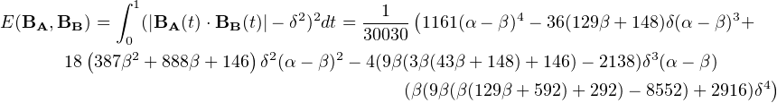

# Offsetting parameterised Bezier curves
### Simon Cozens

A common problem in type design is the creation of pairs of curves representing the stroke of a pen: an inner curve and an outer curve delimit the contours of a writing implement of fixed or flexible thickness. While it is impossible to precisely offset a Bezier curve at a given width, this paper presents a simple approximation by minimizing the error between desired distance and actual distance. This can also be applied to situations where the thickness varies linearly across the width of the
curve.

We use a simplification due to Tunni, who postulates that any curve **a**, **b**, **c**, **d** with straight handles (i.e. where the control points **b**and **c** are positioned orthogonally to **a** and **d** respectively) can be represented in terms of start and end points **a**and **d** and a curve tension *τ*. To determine curve tension, compute the point **T** where **ab**  intersects **cd**: 

The curve tension is given by the mean of the ratios  and . Given the points **a**, **d** and a tension τ we can compute the Bezier control points **b**, **c** by setting them at the appropriate
ratios.

This conceptualization enables us to find similar parameters for an offset Bezier curve. We will approach the problem in small pieces, demonstrating the technique first before solving the general case.

## Outer offset of a unit Bezier curve

Consider first the unit Bezier curve **B****A** with **a** = (0,1), **d** = (1,0) and **c** and **d** chosen as orthogonal control
points with a curve tension *α*. What are the parameters for a Bezier curve **B****B** offsetting this curve on the
outside at a fixed distance *δ*?

Clearly we have ***a** = (0, 1 + *δ*), **d** = (1 + *δ*, 0)*, so it remains to find the curve tension *β*.

As a function of time, the distance between the two curves is:

<table 
class="equation"><tr><td>
   

</td><td class="equation-label">[1]</td></tr></table>

and at any point on the curve, the expected distance is *δ*. Knowing it is impossible to achieve a perfect
offset, we can treat this as an optimization problem: find the value of *β* which minimizes the total error function

<table 
class="equation"><tr><td>
   

</td><td class="equation-label">[2]</td></tr></table>

This integral turns out to be tricky to compute due to the presence of the square root, so instead we create an equivalent error function using the square of the distance. We expect the square of the distance to be *δ*2, and
we square the difference of these two values to perform a least squares optimization. This leads to an error
function of

<table 
class="equation"><tr><td>
   

</td><td class="equation-label">[3]</td></tr></table>

For a unit Bezier, we have:

<table class="multline"><tr><td></td><td class="equation-label"> [4] </td></tr></table>

leading to a square distance

<table class="multline"><tr><td></td><td class="equation-label"> [5] </td></tr></table>
<!--l. 103-->   and therefore an error function
<!--l. 105-->   <table 
class="multline"><tr><td></td><td class="equation-label"> [6] </td></tr></table>

This looks horrific, but it’s only a quartic, and is easily optimizable. Rather than solving the differential equation for the general case, let’s be practical, remember that *α* and *δ* will be given and go for a numerical method to minimize the error function.

Beginning with *β*1 = *α* and applying the Newton-Raphson optimization method gives us an iterated
function

<table 
class="multline"><tr><td></td><td class="equation-label"> [7] </td></tr></table>

which quickly converges to the minimum error, giving us the optimal curve tension.

As an example, plugging in *α = 0.55, δ = 1*:

*β*1 = 0.55

*β*2 = 0.550987

*β*3 = 0.550985

*β*4 = 0.550985

## We can cheat

Thankfully, we find by inspection that the optimal value of *β* given *α* and *δ*, *β(α, δ)* turns out to be pretty much linear in both *α* and *δ* when *α >= 0.3*. A very pleasing result is:

 <table 
class="equation"><tr><td>
                                                                                      
                                                                                      
   

</td><td class="equation-label">[8]</td></tr></table>

Note that this gives exactly the answer given by our Newton-Raphson method above. A more general, but less accurate, approximation is:

<table class="equation"><tr><td>
   

</td><td class="equation-label">[9]</td></tr></table>

## Inner offsetting of a unit Bezier

What if we want to go the other way, and find the inner curve at a fixed distance?

A very similar pattern applies, but this time we construct ***B****B*** as ***a** = (0, 1-δ), **d** = (1-δ, 0)* and the Newton step  is
<!--l. 180-->   <table 
class="multline"><tr><td></td><td class="equation-label"> [10] </td></tr></table>
                                                                                      
                                                                                      
<!--l. 194-->   Equally, we can invert our approximation <a 
href="#x1-2002r9">9<!--tex4ht:ref: approx --></a> above, giving:
   <table 
class="equation"><tr><td>
   

</td><td class="equation-label">[11]</td></tr></table>

## Outer offsetting of an arbitrary normalized curve

Real-world curves are not unit curves (0,1)&#x22C5;&#x22C5;&#x22C5;(1, 0). However, we can always use affine transformation to locate
the start at **a** = (1, 0), leaving the end at **d** = (0,*x*). The control points for a Bezier curve with tension *τ* **B****A**

would then be set at ***b** = (1-τ,0), **c** = (0,x(1-τ))*. The problem, again, is to find the offset curve **B****B** which
best approximates a fixed distance *δ* from **B****A**.

Now we have ***a** = (0, 1 + *δ*), **d** = (x + δ, 0)*. Following exactly the procedure above, the square
of the distance between the two curves at point *t* , is

<table class="multline"><tr><td></td><td class="equation-label"> [12] </td></tr></table>

and the total error across the curve is

<table class="multline"><tr><td></td><td class="equation-label"> [13] </td></tr></table>

Once again, it’s only a quartic and three of the variables are given. We can apply the Newton-Raphson
method again, giving:

<table 
class="multline"><tr><td></td><td class="equation-label"> [14] </td></tr></table>

By iterating this approximation, we can derive the tension for a curve at an offset of a given distance *δ* from
an arbitrary Bezier curve specified by two points and a curve tension parameter.

But wait, it gets more complicated.

## Offsetting at a linear-gradiated distance

Strokes in fonts often have a feature called *contrast*, meaning that the horizontal offset is not the same as the
vertical offset:

To model this we will assume that the desired distance between curves is a linear function of curve time *t* :

<table 
class="equation"><tr><td>
   

</td><td class="equation-label">[15]</td></tr></table>
 

And now our error function is

 <table 
class="equation"><tr><td>
   

</td><td class="equation-label">[16]</td></tr></table>

The total integrated error across the curve becomes... very complicated, but computable. We can apply a similar Newton-Raphson method as above, leading to the functions given in the associated Python script.
