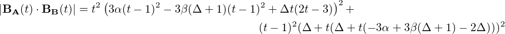

<h2 class="titleHead">Offsetting parameterised Bezier curves</h2>

Simon Cozens
 

May 16, 2017

<!--l. 27-->
   A common problem in type design is the creation of pairs of curves representing the stroke of a pen: an
inner curve and an outer curve delimit the contours of a writing implement of fixed or flexible
thickness. While it is impossible to precisely offset a Bezier curve at a given width, this paper presents
a simple approximation by minimizing the error between desired distance and actual distance.
This can also be applied to situations where the thickness varies linearly across the width of the
curve.
<!--l. 29-->
   We use a simplification due to Tunni, who postulates that any curve a,b,c,d with straight handles (i.e.
where the control points b and c are positioned orthogonally to a and drespectively) can be represented in
terms of start and end points a and d and a curve tension &#x03C4;. To determine curve tension, compute the point T
where ab intersects cd:
<!--l. 32-->
    
<!--l. 43-->
   The curve tension is given by the mean of the ratios  and . Given the points <tspan font-family="cmbx" font-size="10">a</tspan><tspan font-family="cmmi" font-size="10">,</tspan><tspan font-family="cmbx" font-size="10">d</tspan>
and a tension <tspan font-family="cmmi" font-size="10">&#x03C4; </tspan>we can compute the Bezier control points <tspan font-family="cmbx" font-size="10">b</tspan><tspan font-family="cmmi" font-size="10">,</tspan><tspan font-family="cmbx" font-size="10">c</tspan> by setting them at the appropriate
ratios.
<!--l. 45-->
   This conceptualization enables us to find similar parameters for an offset Bezier curve. We will
approach the problem in small pieces, demonstrating the technique first before solving the general
case.
   <h3 class="sectionHead">1    Outer offset of a unit Bezier curve</h3>
<!--l. 49-->
Consider first the unit Bezier curve <tspan font-family="cmbx" font-size="10">B</tspan><tspan font-family="cmbx" font-size="7">A</tspan> with <tspan font-family="cmbx" font-size="10">a </tspan>= (0<tspan font-family="cmmi" font-size="10">,</tspan>1)<tspan font-family="cmmi" font-size="10">,</tspan><tspan font-family="cmbx" font-size="10">d </tspan>= (1<tspan font-family="cmmi" font-size="10">,</tspan>0) and <tspan font-family="cmbx" font-size="10">c </tspan>and <tspan font-family="cmbx" font-size="10">d </tspan>chosen as orthogonal control
points with a curve tension <tspan font-family="cmmi" font-size="10">&#x03B1;</tspan>. What are the parameters for a Bezier curve <tspan font-family="cmbx" font-size="10">B</tspan><tspan font-family="cmbx" font-size="7">B</tspan> offsetting this curve on the
outside at a fixed distance <tspan font-family="cmmi" font-size="10">&#x03B4;</tspan>?
<!--l. 52-->
    
                                                                                      
                                                                                      
<!--l. 64-->
   Clearly we have <tspan font-family="cmbx" font-size="10">a </tspan>= (0<tspan font-family="cmmi" font-size="10">,</tspan>1 + <tspan font-family="cmmi" font-size="10">&#x03B4;</tspan>)<tspan font-family="cmmi" font-size="10">,</tspan><tspan font-family="cmbx" font-size="10">d </tspan>= (1 + <tspan font-family="cmmi" font-size="10">&#x03B4;,</tspan>0), so it remains to find the curve tension <tspan font-family="cmmi" font-size="10">&#x03B2;</tspan>.
<!--l. 66-->
   As a function of time, the distance between the two curves is:
   <table 
class="equation"><tr><td>
   

</td><td class="equation-label">[1]</td></tr></table>
<!--l. 68-->

<!--l. 70-->
   and at any point on the curve, the expected distance is <tspan font-family="cmmi" font-size="10">&#x03B4;</tspan>. Knowing it is impossible to achieve a perfect
offset, we can treat this as an optimization problem: find the value of <tspan font-family="cmmi" font-size="10">&#x03B2; </tspan>which minimizes the total error
function
   <table 
class="equation"><tr><td>
   

</td><td class="equation-label">[2]</td></tr></table>
<!--l. 73-->

<!--l. 75-->
   This integral turns out to be tricky to compute due to the presence of the square root, so instead we create
an equivalent error function using the square of the distance. We expect the square of the distance to be <tspan font-family="cmmi" font-size="10">&#x03B4;</tspan><tspan font-family="cmr" font-size="7">2</tspan>, and
we square the difference of these two values to perform a least squares optimization. This leads to an error
function of
   <table 
class="equation"><tr><td>
   

</td><td class="equation-label">[3]</td></tr></table>
<!--l. 77-->

<!--l. 79-->
   For a unit Bezier, we have:
                                                                                      
                                                                                      
<!--l. 81-->
   <table 
class="multline"><tr><td></td><td class="equation-label"> [4] </td></tr></table>
<!--l. 97-->
   leading to a square distance
<!--l. 99-->
   <table 
class="multline"><tr><td></td><td class="equation-label"> [5] </td></tr></table>
<!--l. 103-->
   and therefore an error function
<!--l. 105-->
   <table 
class="multline"><tr><td></td><td class="equation-label"> [6] </td></tr></table>
<!--l. 111-->
   This looks horrific, but it&#8217;s only a quartic, and is easily optimizable. Rather than solving the differential
equation for the general case, let&#8217;s be practical, remember that <tspan font-family="cmmi" font-size="10">&#x03B1; </tspan>and <tspan font-family="cmmi" font-size="10">&#x03B4; </tspan>will be given and go for a numerical
method to minimize the error function.
<!--l. 113-->
   Beginning with <tspan font-family="cmmi" font-size="10">&#x03B2;</tspan><tspan font-family="cmr" font-size="7">1</tspan> = <tspan font-family="cmmi" font-size="10">&#x03B1; </tspan>and applying the Newton-Raphson optimization method gives us an iterated
function
<!--l. 115-->
   <table 
class="multline"><tr><td></td><td class="equation-label"> [7] </td></tr></table>
<!--l. 136-->
   quickly converges to the minimum error, giving us the optimal curve tension.
<!--l. 138-->
   As an example, plugging in <tspan font-family="cmmi" font-size="10">&#x03B1; </tspan>= 0<tspan font-family="cmmi" font-size="10">.</tspan>55<tspan font-family="cmmi" font-size="10">,</tspan>&#x0394; = 1:
<!--l. 140-->

<table 
class="align-star">
                                     <tr><td 
class="align-odd"><tspan font-family="cmmi" font-size="10">&#x03B2;</tspan><tspan font-family="cmr" font-size="7">1</tspan> = 0<tspan font-family="cmmi" font-size="10">.</tspan>55</td>                                         <td 
class="align-even"></td>                                     <td 
class="align-label">
                                     </td></tr><tr><td 
class="align-odd"><tspan font-family="cmmi" font-size="10">&#x03B2;</tspan><tspan font-family="cmr" font-size="7">2</tspan> = 0<tspan font-family="cmmi" font-size="10">.</tspan>550987</td>                                     <td 
class="align-even"></td>                                     <td 
class="align-label">
                                     </td></tr><tr><td 
class="align-odd"><tspan font-family="cmmi" font-size="10">&#x03B2;</tspan><tspan font-family="cmr" font-size="7">3</tspan> = 0<tspan font-family="cmmi" font-size="10">.</tspan>550985</td>                                     <td 
class="align-even"></td>                                     <td 
class="align-label">
                                     </td></tr><tr><td 
class="align-odd"><tspan font-family="cmmi" font-size="10">&#x03B2;</tspan><tspan font-family="cmr" font-size="7">4</tspan> = 0<tspan font-family="cmmi" font-size="10">.</tspan>550985</td>                                     <td 
class="align-even"></td>                                     <td 
class="align-label"></td></tr></table>
<!--l. 147-->

   <h4 class="subsectionHead">1.1    We can cheat</h4>
<!--l. 149-->
Thankfully, we find by inspection that the optimal value of <tspan font-family="cmmi" font-size="10">&#x03B2; </tspan>given <tspan font-family="cmmi" font-size="10">&#x03B1; </tspan>and &#x0394;, <tspan font-family="cmmi" font-size="10">&#x03B2;</tspan>(<tspan font-family="cmmi" font-size="10">&#x03B1;,</tspan>&#x0394;) turns out to be pretty
much linear in both <tspan font-family="cmmi" font-size="10">&#x03B1; </tspan>and &#x0394; when <tspan font-family="cmmi" font-size="10">&#x03B1; </tspan><tspan font-family="cmsy" font-size="10">&#x2265; </tspan>0<tspan font-family="cmmi" font-size="10">.</tspan>3. A very pleasing result is:
   <table 
class="equation"><tr><td>
                                                                                      
                                                                                      
   

</td><td class="equation-label">[8]</td></tr></table>
<!--l. 153-->

<!--l. 155-->
   Note that this gives exactly the answer given by our Newton-Raphson method above. A more general, but
less accurate, approximation is:
   <table 
class="equation"><tr><td>
   

</td><td class="equation-label">[9]</td></tr></table>
<!--l. 159-->

<!--l. 161-->

   <h3 class="sectionHead">2    Inner offsetting of a unit Bezier</h3>
<!--l. 163-->
What if we want to go the other way, and find the inner curve at a fixed distance?
<!--l. 173-->
   
<!--l. 176-->
   A very similar pattern applies, but this time we construct <tspan font-family="cmbx" font-size="10">B</tspan><tspan font-family="cmbx" font-size="7">B</tspan> as <tspan font-family="cmbx" font-size="10">a </tspan>= (0<tspan font-family="cmmi" font-size="10">,</tspan>1 <tspan font-family="cmsy" font-size="10">-</tspan><tspan font-family="cmmi" font-size="10">&#x03B4;,</tspan><tspan font-family="cmbx" font-size="10">d </tspan>= (1 <tspan font-family="cmsy" font-size="10">-</tspan><tspan font-family="cmmi" font-size="10">&#x03B4;,</tspan>0) and the Newton
step  is
<!--l. 180-->
   <table 
class="multline"><tr><td></td><td class="equation-label"> [10] </td></tr></table>
                                                                                      
                                                                                      
<!--l. 194-->
   Equally, we can invert our approximation <a 
href="#x1-2002r9">9<!--tex4ht:ref: approx --></a> above, giving:
   <table 
class="equation"><tr><td>
   

</td><td class="equation-label">[11]</td></tr></table>
<!--l. 198-->

<!--l. 200-->

   <h3 class="sectionHead">3    Outer offsetting of an arbitrary normalized curve</h3>
<!--l. 202-->
Real-world curves are not unit curves (0<tspan font-family="cmmi" font-size="10">,</tspan>1)<tspan font-family="cmsy" font-size="10">&#x22C5;&#x22C5;&#x22C5;</tspan>(1<tspan font-family="cmmi" font-size="10">,</tspan>0). However, we can always use affine transformation to locate
the start at <tspan font-family="cmbx" font-size="10">a </tspan>= (1<tspan font-family="cmmi" font-size="10">,</tspan>0), leaving the end at <tspan font-family="cmbx" font-size="10">d </tspan>= (0<tspan font-family="cmmi" font-size="10">,x</tspan>). The control points for a Bezier curve with tension <tspan font-family="cmmi" font-size="10">&#x03C4;</tspan> <tspan font-family="cmbx" font-size="10">B</tspan><tspan font-family="cmbx" font-size="7">A</tspan>
would then be set at <tspan font-family="cmbx" font-size="10">b </tspan>= (1 <tspan font-family="cmsy" font-size="10">-</tspan><tspan font-family="cmmi" font-size="10">&#x03C4;,</tspan>0)<tspan font-family="cmmi" font-size="10">,</tspan><tspan font-family="cmbx" font-size="10">c </tspan>= (0<tspan font-family="cmmi" font-size="10">,x</tspan>(1 <tspan font-family="cmsy" font-size="10">-</tspan><tspan font-family="cmmi" font-size="10">&#x03C4;</tspan>)). The problem, again, is to find the offset curve <tspan font-family="cmbx" font-size="10">B</tspan><tspan font-family="cmbx" font-size="7">B</tspan> which
best approximates a fixed distance <tspan font-family="cmmi" font-size="10">&#x03B4; </tspan>from <tspan font-family="cmbx" font-size="10">B</tspan><tspan font-family="cmbx" font-size="7">A</tspan>.
<!--l. 204-->
   Now we have <tspan font-family="cmbx" font-size="10">a </tspan>= (0<tspan font-family="cmmi" font-size="10">,</tspan>1 + <tspan font-family="cmmi" font-size="10">&#x03B4;</tspan>)<tspan font-family="cmmi" font-size="10">,</tspan><tspan font-family="cmbx" font-size="10">d </tspan>= (<tspan font-family="cmmi" font-size="10">x </tspan>+ <tspan font-family="cmmi" font-size="10">&#x03B4;,</tspan>0). Following exactly the procedure above, <tspan font-family="cmsy" font-size="10">|</tspan><tspan font-family="cmbx" font-size="10">B</tspan><tspan font-family="cmbx" font-size="7">A</tspan>(<tspan font-family="cmmi" font-size="10">t</tspan>) <tspan font-family="cmsy" font-size="10">&#x22C5;</tspan><tspan font-family="cmbx" font-size="10">B</tspan><tspan font-family="cmbx" font-size="7">B</tspan>(<tspan font-family="cmmi" font-size="10">t</tspan>)<tspan font-family="cmsy" font-size="10">|</tspan>, the square
of the distance between the two curves at point <tspan font-family="cmmi" font-size="10">t</tspan>, is
<!--l. 206-->
   <table 
class="multline"><tr><td></td><td class="equation-label"> [12] </td></tr></table>
<!--l. 210-->
   and the total error across the curve is
<!--l. 212-->
   <table 
class="multline"><tr><td></td><td class="equation-label"> [13] </td></tr></table>
<!--l. 222-->
   Once again, it&#8217;s only a quartic and three of the variables are given. We can apply the Newton-Raphson
method again, giving:
<!--l. 224-->
   <table 
class="multline"><tr><td></td><td class="equation-label"> [14] </td></tr></table>
<!--l. 240-->
   By iterating this approximation, we can derive the tension for a curve at an offset of a given distance <tspan font-family="cmmi" font-size="10">&#x03B4; </tspan>from
an arbitrary Bezier curve specified by two points and a curve tension parameter.
<!--l. 242-->
   But wait, it gets more complicated.
<!--l. 244-->

   <h3 class="sectionHead">4    Offsetting at a linear-gradiated distance</h3>
<!--l. 246-->
Strokes in fonts often have a feature called <tspan font-family="cmti" font-size="10">contrast</tspan>, meaning that the horizontal offset is not the same as the
vertical offset:
<!--l. 249-->
    
<!--l. 259-->
   To model this we will assume that the desired distance between curves is a linear function of curve time
<tspan font-family="cmmi" font-size="10">t</tspan>:
   <table 
class="equation"><tr><td>
   

</td><td class="equation-label">[15]</td></tr></table>
                                                                                      
                                                                                      
<!--l. 263-->

<!--l. 265-->
   And now our error function is
   <table 
class="equation"><tr><td>
   

</td><td class="equation-label">[16]</td></tr></table>
<!--l. 268-->

<!--l. 270-->
   The total integrated error across the curve becomes&#x2026;&#x00A0;very complicated, but computable. We can apply a
similar Newton-Raphson method as above, leading to the functions given in the associated Python
script.

